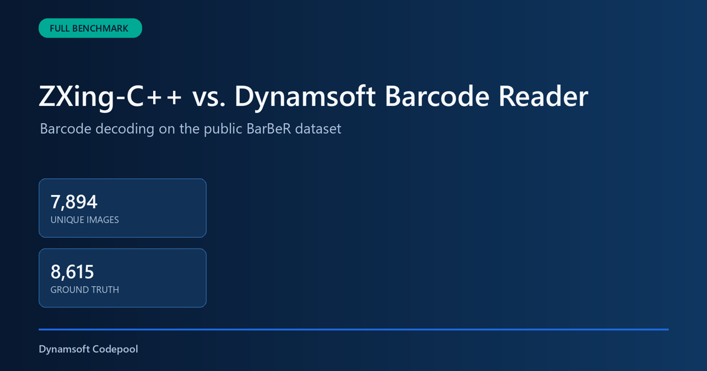

An auditable C++ barcode benchmark must give every reader the same pixels, ground truth, format policy, and timing boundary. This project compares ZXing-C++ with Dynamsoft Barcode Reader on 7,894 unique images from the public BarBeR dataset and preserves every raw result for independent review.



**What you'll build:** A reproducible Windows C++ benchmark that builds ZXing-C++ from a Git submodule, runs both barcode readers on one RGB888 image buffer, validates BarBeR ground truth, and exports raw JSONL plus a complete JSON package.

## Full BarBeR Benchmark Video

The video summarizes the complete dataset audit, the shared input method, and the measured results.

<video src="assets/barcode-benchmark-video.mp4" controls="controls" muted="muted" width="100%"></video>

## Key Takeaways

- The benchmark contains 7,894 unique images and 8,615 structurally valid ground truth barcode instances.
- ZXing-C++ and Dynamsoft Barcode Reader receive the same RGB888 pixel buffer for every image.
- Image loading, result matching, JSON serialization, and report generation are excluded from SDK decode timing.
- The BarBeR audit excludes 853 images without reliable payload ground truth and one exact duplicate image.
- On this single full-dataset run with DBR `ReadBarcodes_Default`, DBR achieved 86.41% recall versus 67.96% for ZXing-C++, while averaging 70.08 ms versus 74.09 ms for ZXing-C++.

## Common Developer Questions

### How do I compare ZXing-C++ and Dynamsoft Barcode Reader fairly in C++?

A fair comparison loads each image once, passes the same immutable pixels to both SDKs, enables their supported formats without per-image hints, and measures only the decoder call. The project also uses one location-independent matching function for both result sets.

### Does the ZXing-C++ submodule replace stb_image?

The ZXing-C++ submodule does not replace `stb_image` in this project. ZXing-C++ reads pixel views, while `stb_image` decodes JPEG and PNG files into the shared RGB888 buffer used by both readers.

### Which barcode reader performed better on the BarBeR dataset?

Dynamsoft Barcode Reader achieved higher recall on this BarBeR run with 7,444 of 8,615 ground truth instances read correctly, compared with 5,855 for ZXing-C++. ZXing-C++ had higher precision at 93.17%, compared with 91.44% for DBR. DBR had a slightly lower mean decode time at 70.08 ms, compared with 74.09 ms for ZXing-C++.

## Prerequisites

- Visual Studio 2022 with the C++ desktop workload
- CMake 3.16 or later
- Dynamsoft Capture Vision SDK 11.4.20.7177
- ZXing-C++ 3.1.0 from the project submodule
- Python 3 with Pillow for report media generation
- A valid Dynamsoft license key. [Get a 30-day free trial license](https://www.dynamsoft.com/customer/license/trialLicense/?product=dcv&package=cross-platform).

## Step 1: Build ZXing-C++ with the Benchmark

The root repository records ZXing-C++ as a Git submodule, and CMake builds its core reader target with the benchmark.

```cmake
set(ZXING_READERS ON CACHE BOOL "" FORCE)
set(ZXING_WRITERS OFF CACHE STRING "" FORCE)
set(ZXING_C_API OFF CACHE BOOL "" FORCE)
set(ZXING_EXAMPLES OFF CACHE BOOL "" FORCE)
set(ZXING_UNIT_TESTS OFF CACHE BOOL "" FORCE)
if(NOT EXISTS "${CMAKE_CURRENT_SOURCE_DIR}/zxing-cpp/CMakeLists.txt")
    message(FATAL_ERROR "ZXing-C++ submodule is missing. Run: git submodule update --init --recursive")
endif()
add_subdirectory(zxing-cpp EXCLUDE_FROM_ALL)
```

Initialize the submodule and build the executable.

```powershell
git submodule update --init --recursive
cmake -S . -B build -G "Visual Studio 17 2022" -A x64
cmake --build build --config Release --target barcode_benchmark benchmark_tests
ctest --test-dir build -C Release --output-on-failure
```

## Step 2: Give Both Readers the Same Pixels

`stb_image` converts every supported image file into three-channel RGB data. The resulting vector remains unchanged while both decoder adapters read it.

```cpp
bool loadImage(const std::filesystem::path& path, ImageBuffer& output, std::string& error)
{
    int w=0,h=0,n=0; auto* data=stbi_load(path.string().c_str(),&w,&h,&n,3);
    if(!data){error=stbi_failure_reason()?stbi_failure_reason():"stb_image failed";return false;}
    output.width=w;output.height=h;output.stride=w*3;
    output.rgb.assign(data,data+static_cast<std::size_t>(output.stride)*h);stbi_image_free(data);return true;
}
```

ZXing-C++ receives an `ImageView` over that buffer.

```cpp
const ZXing::ImageView view(image.rgb.data(), image.width, image.height,
                            ZXing::ImageFormat::RGB, image.stride);
const auto begin = std::chrono::steady_clock::now();
const auto barcodes = ZXing::ReadBarcodes(view, options_);
run.decode_time = std::chrono::steady_clock::now() - begin;
```

Dynamsoft Barcode Reader receives a `CImageData` object over the same bytes.

```cpp
CImageData input(static_cast<int>(image.rgb.size()), image.rgb.data(), image.width, image.height,
                 image.stride, IPF_RGB_888);
const auto begin = std::chrono::steady_clock::now();
CCapturedResult* captured = router_->Capture(&input, template_name_.c_str());
run.decode_time = std::chrono::steady_clock::now() - begin;
```

## Step 3: Audit BarBeR Ground Truth

The audit reads all 12 VGG JSON files, validates payload structures, resolves overlapping annotations, and deduplicates image bytes by SHA-256.

```powershell
build/Release/barcode_benchmark.exe audit `
  --images "D:/images/public-barcode-dataset/BarBeR - Dataset/dataset/images" `
  --annotations "D:/images/public-barcode-dataset/BarBeR - Dataset/Annotations/VIA" `
  --output manifests
```

The audited source contains 8,748 image records and 9,818 annotations. The benchmark manifest contains 7,894 unique images and 8,615 reliable barcode instances after exclusions.

| Dataset stage | Count | How it relates to the run |
|---|---:|---|
| Original image records | 8,748 | All image records referenced by the BarBeR VIA annotations |
| Original annotations | 9,818 | All barcode annotation regions before reliability filtering |
| Images without reliable ground truth | 853 | Removed because the payload was missing, generic, invalid, or not safely scorable |
| Exact duplicate images | 1 | Removed by SHA-256 byte identity |
| Final unique images | 7,894 | The image denominator used by each decoder |
| Final ground truth values | 8,615 | The accuracy denominator used for recall |
| Decoder records | 15,788 | 7,894 images multiplied by two decoders and one measured run |

This connection matters because the benchmark does not score every original BarBeR image. It scores only images with reliable payload ground truth, then verifies that image count, ground truth count, SHA-256 identity, and decoder record count agree before publishing the report.

## Step 4: Run and Validate the Complete Dataset

The benchmark writes one resumable result record per image and decoder. `results.jsonl` is used for the append-only raw stream, which makes long runs easier to resume and validate one line at a time. The project also writes `results.json`, which packages the summary and the same raw records into one JSON document for consumers that expect a single JSON file.

```powershell
build/Release/barcode_benchmark.exe run `
  --images "D:/images/public-barcode-dataset/BarBeR - Dataset/dataset/images" `
  --manifest manifests/benchmark_manifest.jsonl `
  --output results/full `
  --dbr-template ReadBarcodes_Default `
  --zxing-config configs/zxing_all_supported.json `
  --license-key-file "../../license-key.txt" `
  --repetitions 1
```

The validator checks record keys, image counts, ground truth consistency, repetitions, summary totals, and explicit decoder errors.

```powershell
python tools/validate_results.py `
  --results results/full/results.jsonl `
  --summary results/full/summary.json `
  --expected-images 7894 `
  --expected-ground-truth 8615 `
  --expected-repetitions 1
```

## Step 5: Inspect Accuracy and Decode Time

This benchmark ran each decoder once on every one of the 7,894 unique images. The accuracy denominator contains 8,615 ground truth barcode instances. The measured machine used Windows 11 Pro, an Intel Core i5-13400F, 31.8 GB of memory, a Release x64 build, and one thread per decoder task.

Recall and precision answer different questions. Recall measures how many known barcodes were found. Precision measures how many reported barcode results were correct.

```text
Recall = correct ground truth matches / eligible ground truth instances
Precision = correct predictions / evaluated predictions
Evaluated predictions = correct + wrong_text + wrong_format + extra_result
```

In this benchmark, `not_found` and `unsupported_format` lower recall because they are missed ground truth instances. They do not lower precision because no decoded value was reported for those ground truth items. `extra_result`, `wrong_text`, and `wrong_format` lower precision because the decoder returned a result that did not match a ground truth barcode.

| Decoder | Correct | Recall | Precision | Image all-read rate | Mean decode time | Median decode time | P95 decode time |
|---|---:|---:|---:|---:|---:|---:|---:|
| Dynamsoft Barcode Reader 11.4.20.7177 | 7,444 / 8,615 | 86.41% | 91.44% | 86.57% | 70.08 ms | 44.99 ms | 208.51 ms |
| ZXing-C++ 3.1.0 | 5,855 / 8,615 | 67.96% | 93.17% | 67.79% | 74.09 ms | 44.34 ms | 250.22 ms |

DBR produced 1,589 more correct ground truth matches and improved recall by 18.44 percentage points in this run. ZXing-C++ had 1.73 percentage points higher precision. DBR's mean decoder call was about 5.4% lower than ZXing-C++ in this run. These results show a recall, precision, and latency trade-off on this dataset rather than a universal ranking for every barcode workload.

The matcher normalizes UPC-A against the equivalent zero-prefixed EAN-13 payload before scoring. A full scan of the incorrect records found no remaining cases where a result was wrong only because one side had an extra leading zero. The canonical format normalizer also treats `CODE39EXTENDED` as `CODE_39` when the decoded payload is the same.

This benchmark was implemented and published by Dynamsoft, the developer of Dynamsoft Barcode Reader. BarBeR is a public third-party dataset, and its standardized annotations were generated with assistance from proprietary Datalogic software. The source hashes, exclusions, configurations, raw records, and report are preserved so the comparison can be audited.

The static report embeds searchable per-image records and copies the complete JSONL, complete JSON package, summary, matching analysis, and source inventory into its download directory.

```powershell
python tools/generate_html_report.py `
  --inventory manifests/barber_source_files.json `
  --environment configs/benchmark_environment.json `
  --results results/full/results.jsonl `
  --results-json results/full/results.json `
  --matching-analysis results/full/matching_analysis.json `
  --summary results/full/summary.json `
  --output report/index.html
```

## Common Issues & Edge Cases

- **The ZXing-C++ directory is empty:** Run `git submodule update --init --recursive` before configuring CMake.
- **DBR fails during initialization:** Provide a valid license and confirm that CMake copied the DBR templates, models, and runtime libraries into `build/Release`.
- **A BarBeR image has no reliable payload:** Regenerate the manifest with the audit command. Images with missing payloads, negative PPE values, invalid GTIN checksums, or generic 1D labels are not scored.
- **A run stops before completion:** Run the same command again. Existing sample, decoder, and repetition keys are skipped.

## Conclusion

This C++ project produces an auditable comparison of ZXing-C++ and Dynamsoft Barcode Reader from 7,894 real BarBeR images. The shared pixel pipeline, explicit exclusions, raw records, complete JSON package, and generated report make the measured accuracy and decode time reproducible.

## Source Code

[Get the complete C++ barcode benchmark on GitHub](https://github.com/yushulx/cmake-cpp-barcode-qrcode/tree/main/examples/benchmark)
